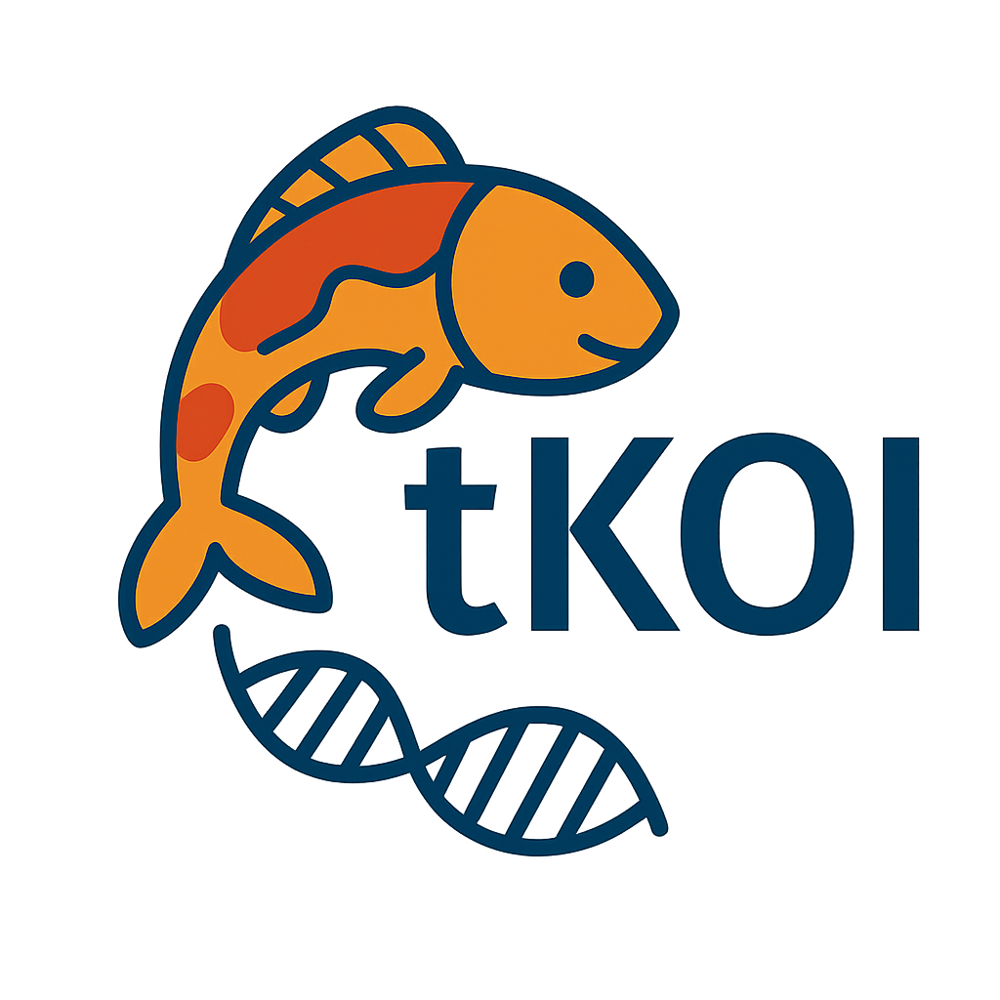

<!-- README.md is generated from README.Rmd. Please edit that file -->

# tKOI 

**Transcriptomic Knowledge-Graph Omics Integration for Human Pathway
Analysis**

The `tkoi` package provides an integrative framework that combines
transcriptomic data with a human-specific biological knowledge graph.
This enables network-aware enrichment, functional interpretation, and
gene prioritization via personalized PageRank and ontology-aware
annotation.

## Shiny App

Launch the Shiny app from the installed R package:

``` r
tkoi::run_tkoi_app()
```

Install the optional app dependencies once if needed:

``` r
install.packages(c(
  "shiny", "shinythemes", "data.table", "readxl", "openxlsx", "plotly", "DT"
))
```

The app accepts CSV, TSV, or Excel files with `gene_name`, `logfc`, and
`pvalue` columns. It runs the package’s analysis and lets you explore
and export the results.

To serve the installed app on a network interface:

``` r
tkoi::run_tkoi_app(host = "0.0.0.0", port = 3838, launch_browser = FALSE)
```

The [app
source](https://github.com/BaranziniLab/tkoi/tree/main/inst/shiny/tkoi),
tests, and deployment scripts are maintained in this repository. You can
also use the [hosted app](https://comphealth.ucsf.edu/app/tkoi).

### Standalone Server Deployment

Download `tkoi-shiny-1.3.0.zip` or `tkoi-shiny-1.3.0.tar.gz` from the
[GitHub releases](https://github.com/BaranziniLab/tkoi/releases),
extract it, and run these commands from the extracted app directory:

``` sh
Rscript install.R
Rscript run_app.R 3838 0.0.0.0
```

The bundle includes the complete app and the matching R package at
`vendor/tkoi_1.3.0.tar.gz`. The installer uses that archive and
downloads its other dependencies from CRAN and Bioconductor. Setup
requires R 4.1 or later, a C++ compiler, and internet access for those
dependencies.

For Shiny Server, place the extracted directory in its configured app
directory and install the dependencies for the account running the
service. For Posit Connect, publish the extracted directory as a Shiny
application. `app.R` is the entry point. The bundle’s README and the
[getting started
guide](https://baranzinilab.github.io/tkoi/articles/getting-started-with-tkoi.html)
provide more detail.

## Agent Workflows

[tKOIAgent](https://github.com/BaranziniLab/tKOIAgent) provides the
`tkoi-agent` plugin for [Codex](https://openai.com/codex/), [Claude
Code](https://claude.com/product/claude-code), and
[BioRouter](https://biorouter.ucsf.edu/). Its `tkoi-analysis` skill
guides input preparation and analysis; its `tkoi-knowledge-graph` skill
explores the graph through a local MCP connection. Follow the plugin’s
[README](https://github.com/BaranziniLab/tKOIAgent/blob/main/README.md),
[setup
guide](https://github.com/BaranziniLab/tKOIAgent/blob/main/skills/tkoi-analysis/references/setup.md),
and [preprocessing
guide](https://github.com/BaranziniLab/tKOIAgent/blob/main/skills/tkoi-analysis/references/preprocessing.md).

Since version 1.3.0, `run_tkoi()` keeps the exact input graph in its
result. Save the result and connect the plugin’s `connect_analysis` tool
to the absolute RDS path so enrichment and traversal use that same
graph:

``` r
graph = tkoi::get_analysis_graph(tkoi_result)
saveRDS(tkoi_result, "analysis.rds")
normalizePath("analysis.rds")
```

Keep the `analysis_id` returned by `connect_analysis` and supply it to
every subsequent MCP tool call. The server rejects stale IDs or changed
files rather than silently switching graphs.

Graph paths and enrichment scores support associations and hypotheses;
they do not establish causality. See the [agent workflow
guide](https://baranzinilab.github.io/tkoi/articles/agent-workflows.html)
for the MCP tools, direct R use, and graph attribute limits.

## Documentation

Please refer to
**[Documentation](https://baranzinilab.github.io/tkoi/)** for detailed
documentation of this R package. The source code is on
**[GitHub](https://github.com/BaranziniLab/tkoi)**, and changes between
versions are listed in
[NEWS.md](https://github.com/BaranziniLab/tkoi/blob/main/NEWS.md).

## Installation

To install the development version from GitHub:

``` r
# Install devtools if necessary
install.packages("devtools")

# Install tkoi
devtools::install_github("BaranziniLab/tkoi")
```

The former address `Broccolito/tkoi` redirects to `BaranziniLab/tkoi`.
`tkoi` requires R 4.1 or later.

Since version 1.1.0, `tkoi` compiles C++ code during installation, so a
compiler toolchain is required:

- **macOS**: Xcode Command Line Tools (run `xcode-select --install` in a
  terminal)
- **Windows**: [Rtools](https://cran.r-project.org/bin/windows/Rtools/)
  matching your R version
- **Linux**: a C++ compiler, e.g. `build-essential` on Debian/Ubuntu

The Bioconductor dependencies (`clusterProfiler`, `org.Hs.eg.db`) are
installed automatically. If that step fails, install them first with
`BiocManager` and then install `tkoi` again:

``` r
install.packages("BiocManager")
BiocManager::install(c("clusterProfiler", "org.Hs.eg.db"))
```

## Core Features

- Personalized PageRank propagation using transcriptomic weights
- Permutation-based enrichment scoring for network nodes
- Fast, multithreaded C++ engine that solves PageRank for the observed
  data and all permutations in batches
- Reproducible results: `set.seed()` fixes the permutation null, and
  results are identical for any number of cores
- Functional annotation using Gene Ontology, Disease Ontology, Cell
  Ontology, Reactome, and more
- Modular and extensible S4 object design (`tKOIList`)
- Export and visualization tools for enriched subnetworks
- Side-by-side comparison with Gene Ontology enrichment from
  `clusterProfiler`, and plots built with `ggplot2`

## Performance

The core of `run_tkoi()` is written in C++ (via `Rcpp`). Personalized
PageRank for the observed data and every permutation is solved in
batches of up to 16 vectors per pass over the network, using conjugate
gradient on multiple threads. Two-hop neighbourhood counts use bitsets,
and the degree-matched null gene sets are sampled in C++.

Measured on an Apple M2 (8 cores) with a 21,414-gene differential
expression dataset (1,201 seed genes) on the full `tkoi_net`:

- 10 permutations: 48.5 s with `tkoi` 1.0.0 vs 5.3 s with `tkoi` 1.1.0
  (8.8 s for the first run in a session, which also builds the network
  matrix)
- 100 permutations: 244.3 s with `tkoi` 1.0.0 vs 25.5 to 38.1 s with
  `tkoi` 1.1.0 (the range is run-to-run variation from thermal
  throttling)

That is about 6 to 10 times faster. A single core is still faster than
`tkoi` 1.0.0: 10.9 s for 10 permutations with `n_cores = 1`.

With the same `set.seed()`, the permutation null gene sets on `tkoi_net`
are identical to those of a sequential `tkoi` 1.0.0 run, and the
statistics match `tkoi` 1.0.0: `beta` agrees to within 1e-8 and PageRank
vectors to within 6e-15. The result tables are more complete than in
1.0.0: every node is reported (unannotated nodes were dropped before),
the Compound FDR is adjusted over the reported human metabolites only,
nodes with a constant null are reported as untestable (`NaN`) instead of
infinitely significant, and the list of human metabolites was repaired
(see `NEWS.md`). Rows can otherwise be ordered differently only where
FDR and `beta` agree to 10 significant digits, because `tkoi` 1.1.0
orders such ties deterministically. At the default `tolerance = 1e-14`,
the PageRank vectors are at least as accurate as those of
`igraph::page_rank()` on `tkoi_net`, both per node and overall.

Loading `tkoi::tkoi_net` takes a few seconds and about 0.5 GB of memory
the first time it is used in a session. Keeping every permutation
(`keep_permutations = TRUE`) adds about 0.75 GB for 100 permutations.
Before any PageRank is computed, `run_tkoi()` checks the memory the run
needs against the memory available (physical memory, or a Linux
container limit) and stops with advice if the run would not fit.

## Getting Started

### Example Workflow

This section walks you through a complete example using the `tkoi`
package—from reading expression data, running the core network analysis,
to visualizing enrichment results.

### Step 1: Load Example Gene Expression Data

The `tkoi` package includes a small example CSV file containing
simulated gene expression results. We’ll read it using `data.table` for
performance.

``` r
library(tkoi)
library(data.table)

# Get the file path of the example expression data
file_path = system.file("extdata", "example_data.csv", package = "tkoi")

# Read the CSV file
expression_data = fread(file_path)
head(expression_data)
```

The file includes columns:

- `gene_name`: Ensembl gene identifiers
- `logfc`: log2 fold-change values
- `pvalue`: associated p-values for differential expression

Rows with a missing or blank `gene_name` are ignored, and only the first
row of a duplicated gene is used.

### Step 2: Run tKOI Network Enrichment Analysis

`tKOI` integrates transcriptomic changes with a biological knowledge
graph using a personalized PageRank algorithm. It also performs
permutations to assess statistical enrichment.

``` r
set.seed(1)                       # Makes the permutation null reproducible

tkoi_result = run_tkoi(
  expression_data = expression_data,
  subnetwork = tkoi::tkoi_net,    # Predefined igraph network included with the package
  pvalue_threshold = 0.05,        # p-value filter for differential expression
  logfc_threshold = 0.25,         # Minimum log fold change
  indirect_link_threshold = 3,    # Rank first the nodes within two hops of at least 3 seed genes
  topology_similarity = 0.9,      # Similarity for selecting matched genes in permutations
  n_permutation = 100,            # Number of random permutations
  damping_factor = 0.85,          # PageRank damping factor
  maximum_iteration = 500,        # Max solver iterations per PageRank vector
  n_cores = NULL,                 # CPU threads; NULL uses all available cores
  keep_permutations = TRUE        # FALSE keeps only the null mean and SD to save memory
)
```

The result is an S4 object (`tKOIList`) that stores PageRank scores,
permutation statistics, network annotations, and the exact graph
supplied as `subnetwork`. Retrieve that graph with
`tkoi::get_analysis_graph(tkoi_result)` for later traversal.

A few notes on the run settings:

- `indirect_link_threshold` only orders the result tables: nodes within
  two hops of at least that many seed genes are listed first. No node is
  excluded.
- `n_cores` only changes the speed: results are identical for any number
  of cores. Requests above the number of available cores (including
  Slurm and Linux container CPU limits) are capped, and
  `options(tkoi.n_cores = 4)` sets a default for the session.
- `keep_permutations = FALSE` stores only the null mean and standard
  deviation instead of every permutation, which saves memory for large
  `n_permutation`.

Normal upper-tail P-values and within-type BH adjustment are computed in
log space. Result tables retain `log_p_value` and `log_fdr`; positive
numeric P/Q columns use `.Machine$double.xmin` as their minimum
representation, with explicit `p_value_bounded` and `fdr_bounded` flags.
Zero-spread nulls remain untestable. Printing uses scientific notation
without changing R’s global options. Use `tkoi_probability_table(table)`
to add scientific display columns for CSV output, or
`tkoi_format_probability(p, log_p, format = "html")` for HTML exponents.
\* The PageRank solver stops when its relative residual is at most
`tolerance` (default `1e-14`, about 55 iterations per vector on
`tkoi_net`). A warning is raised if a PageRank vector does not converge
within `maximum_iteration` iterations. \* Set `verbose = FALSE` to
silence the progress messages.

### Step 3: Perform Gene Ontology (GO) Enrichment

You can extend the analysis by integrating GO term enrichment using
`clusterProfiler`. This allows for side-by-side comparisons of
ontology-based and graph-based enrichment.

``` r
tkoi_result = run_gene_enrichment(tkoi_result)
```

This adds a `gene_enrichment_comparison` slot containing GO enrichment
tables and visual summaries.

### Step 4: Visualize GO vs Graph Enrichment

Two visualizations are automatically generated:

#### Scatter Plot (All Terms)

``` r
tkoi_result@gene_enrichment_comparison$comparison_scatter1
```

#### Scatter Plot (Faceted by GO Namespace)

``` r
tkoi_result@gene_enrichment_comparison$comparison_scatter2
```

These plots compare tKOI network enrichment (`beta`) with gene ontology
q-values.

### Step 5: Visualize Differential Genes in the Network

The `make_gene_exploration_plot()` function highlights upregulated and
downregulated genes in a scatter plot based on both experimental and
network evidence.

``` r
plt1 = make_gene_exploration_plot(
  tkoi_list = tkoi_result,
  sig_color = "#F39B7FB2",
  non_sig_color = "gray"
)
plt1
```

### Step 6: Export Gene-Level Prioritization Table

This returns a data frame containing logFC, p-values, PageRank scores,
and FDRs for each gene.

``` r
gene_data = export_gene_exploration_data(tkoi_result)
head(gene_data)
```

### Step 7: Visualize Top N Enriched Nodes

Use `visualize_topn()` to highlight the most significantly enriched
genes, pathways, or biological concepts based on network-level
statistics.

``` r
plt2 = visualize_topn(
  tkoi_list = tkoi_result,
  category = "Gene",       # Can also be "Pathway", "BiologicalProcess", etc.
  top_n = 25,
  high_color = "#FF5733",  # Strong enrichment
  low_color = "#154360"    # Moderate enrichment
)
plt2
```

### Step 8: (Optional) Plot the Network Around an Enriched Node

Use `plot_network()` to draw the part of the knowledge graph that links
an enriched node (for example the top biological process) to the
significant genes near it. Genes are colored by log fold change, the
target node is orange, and node size follows the tKOI effect size
(`beta`). By default, the plot uses the graph stored in the analysis
result.

``` r
top_term = tkoi_result@network_summary_statistics$BiologicalProcess$node_id[1]

plot_network(
  tkoi_result = tkoi_result,
  target_node_id = top_term,
  degree_expansion = 2,          # Maximum number of hops between the target and a gene
  network_layout_type = "kk"     # Also "fr", "gem", "graphopt", "lgl", or "mds"
)
```

`plot_network()` returns the plotted `igraph` subgraph invisibly. Pass
the stored graph explicitly to traversal helpers:

``` r
graph = tkoi::get_analysis_graph(tkoi_result)
get_neighboring_nodes(top_term, degree_expansion = 1, subnetwork = graph)
```

### Step 9: (Optional) Save the Analysis Result

Save your full analysis object for future use:

``` r
saveRDS(tkoi_result, "analysis.rds")
tkoi_result = readRDS("analysis.rds")
```

The RDS preserves the analysis graph alongside the results. Older
results that lack a stored graph are rejected by `get_analysis_graph()`;
rerun the analysis with its original graph rather than substituting the
current package graph.

The node-level enrichment tables can also be written to an Excel
workbook, one sheet per node type:

``` r
export_network_summary_statistics(tkoi_result, filename = "tkoi_network_statistics.xlsx")
```

## S4 Object Structure

`tKOIList` is an S4 object returned by `run_tkoi()` with the following
slots:

- `expression_data`: Input transcriptomic measurements
- `subnetwork`: The exact igraph supplied to `run_tkoi()`, including its
  vertex and edge attributes; accessed with `get_analysis_graph()`
- `pagerank_data`: A data frame with one row per network node (row names
  are node IDs): `node_id`, the observed `pagerank`, and either every
  permutation’s PageRank (`perm.1`, `perm.2`, …) or, with
  `keep_permutations = FALSE`, only the null mean and standard deviation
  (`null_mean`, `null_sd`)
- `network_summary_statistics`: Node-level enrichment results, a named
  list with one table per node type (`node_id`, `node_type`,
  `identifier`, `pagerank`, `beta`, `p_value`, `fdr`, `direct_links`,
  `indirect_links`, `valency`, and annotation columns). Every node is
  listed once, with missing annotation columns when no curated
  annotation exists; among compounds, only human metabolites are listed.
  FDR is adjusted within each table, and nodes whose null has no
  variation are untestable (`NaN`) and listed last
- `gene_enrichment_comparison`: GO enrichment overlay and plots, added
  by `run_gene_enrichment()`
- `pvalue_threshold`, `logfc_threshold`, `topology_similarity`,
  `n_permutation`, `damping_factor`, `maximum_iteration`: The settings
  used for the run

## Annotation Resources

Built-in annotation tables support functional interpretation of the
knowledge graph:

- `go_annotation`, `disease_annotation`, `celltype_annotation`,
  `anatomy_annotation`
- `compound_annotation`, `protein_annotation`, `complex_annotation`
- `reaction_annotation`, `pathway_annotation`, `pwgroup_annotation`,
  etc.

Inspect them like so:

``` r
data(go_annotation)
head(go_annotation)
```

## License

MIT + file LICENSE

## Citation

Gu, W., Bellucci, G., Peetoom, B., & Baranzini, S. E. (under review).
Enhanced Transcriptomics Analysis by Integration with Large-Scale
Knowledge Graphs and large language models.

## Contact

**Wanjun Gu** <wanjun.gu@ucsf.edu> ORCID:
[0000-0002-7342-7000](https://orcid.org/0000-0002-7342-7000)
